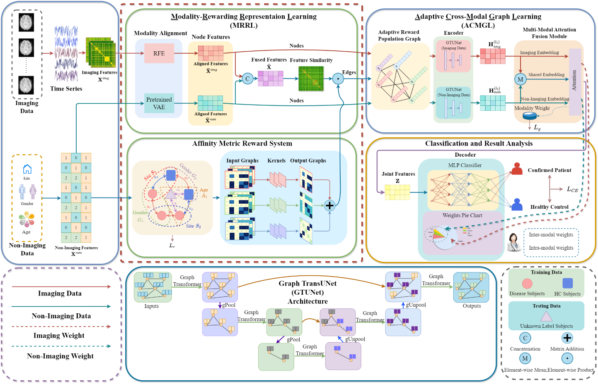

# MM-GTUNets: Unified Multi-Modal Graph Deep Learning for Brain Disorders Prediction



本项目是论文 "[MM-GTUNets: Unified Multi-Modal Graph Deep Learning for Brain Disorders Prediction](https://ieeexplore.ieee.org/document/XXXXXXXX)" 的 PyTorch 实现。

## 项目简介

MM-GTUNets 是一个统一的多模态图深度学习框架，用于脑疾病预测。该模型创新性地整合了：

- **多模态数据融合**：将功能磁共振成像 (fMRI) 连接组数据与表型特征（人口统计学信息）进行深度融合
- **图神经网络**：采用 Graph Transformer U-Net (GTUNet) 分别处理影像和表型数据
- **动态状态编码**：通过滑动窗口 + SVD 降维 + KMeans 聚类提取动态脑状态序列
- **领域适应**：使用梯度反转层 (GRL) 进行站点对抗训练，消除多中心数据偏差
- **注意力机制**：多模态注意力机制和奖赏-惩罚注意力用于图构建

## 目录

1. [环境安装](#环境安装)
2. [项目结构](#项目结构)
3. [数据准备](#数据准备)
4. [训练与测试](#训练与测试)
5. [参数配置](#参数配置)
6. [实验结果](#实验结果)
7. [引用](#引用)

---

## 环境安装

### 依赖要求

```txt
numpy~=1.26.2
scikit-learn~=1.2.2
scipy~=1.10.1
torch~=2.0.0
torch-geometric~=2.0.4
nilearn~=0.10.1
tensorboardX
```

### 安装方式

```bash
pip install -r requirements.txt
```

---

## 项目结构

```
DG/
├── data/                           # 数据目录
│   └── ABIDE_aal/                 # ABIDE 数据集 (AAL 脑区划分)
├── model/                          # 模型定义
│   ├── gtunet.py                  # Graph Transformer U-Net 核心架构
│   ├── mm_gtunets.py              # 多模态 GTUNets 主模型
│   ├── rp_graph.py                # 奖赏-惩罚图构建
│   └── dynamic_encoder.py         # 动态状态编码器
├── utils/                          # 工具函数
│   ├── mydataloader.py            # 数据加载与预处理
│   ├── metrics.py                 # 评估指标 (Accuracy, AUC, Sensitivity, Specificity, F1)
│   └── tools.py                   # 辅助函数
├── result/                        # 实验结果
├── save_model/                     # 保存的模型权重
├── train_mm_gtunets.py             # 主训练脚本
├── opt.py                         # 配置参数
├── fetch_abide.py                 # ABIDE 数据获取
└── requirements.txt               # 依赖包
```

---

## 数据准备

### ABIDE 数据集

使用 `nilearn` 自动获取 ABIDE 公开数据集：

```bash
python fetch_abide.py
```

数据将保存在 `data/ABIDE_aal/` 目录下。

### ADHD-200 数据集

ADHD-200 预处理数据的下载地址：

| 云盘 | 链接 |
|------|------|
| Google Drive | [Link](https://drive.google.com/drive/folders/19HoajzuBFIV0dVGLtWv_jx2c0qg9srX_) |
| Baidu Cloud | [Link](https://pan.baidu.com/s/16sqz0fZvuSHHypMkLtikbA) |

密码：`qj12`

下载后将数据放入对应的数据目录。

---

## 训练与测试

### 训练模型

```bash
# 训练模式 (默认数据集: ABIDE, 脑区模板: AAL)
python train_mm_gtunets.py --train 1
```

### 测试模型

```bash
# 测试模式 (加载已训练模型)
python train_mm_gtunets.py --train 0
```

### 主要参数示例

```bash
# 自定义参数训练
python train_mm_gtunets.py --train 1 --dataset ABIDE --atlas aal --folds 10 --lr 0.0001 --epoch 500
```

---

## 参数配置

### 数据参数

| 参数 | 说明 | 默认值 |
|------|------|--------|
| `--dataset` | 数据集名称 (ABIDE/ADHD) | ABIDE |
| `--atlas` | 脑区模板 (aal/ho) | aal |
| `--num_rois` | 脑区数量 | 116 (aal) / 111 (ho) |
| `--num_subjects` | 受试者数量 | 871 (ABIDE) / 582 (ADHD) |

### 模型参数

| 参数 | 说明 | 默认值 |
|------|------|--------|
| `--node_dim` | 特征选择后的节点维度 | 500 |
| `--img_depth` | 影像分支 U-Net 深度 | 2 |
| `--ph_depth` | 表型分支 U-Net 深度 | 3 |
| `--hidden` | U-Net 隐藏通道数 | 128 |
| `--out` | U-Net 输出通道数 | 16 |
| `--dropout` | Dropout 比例 | 0.3 |
| `--edge_drop` | 边 Dropout 比例 | 0.3 |
| `--pool_ratios` | 图池化比例 | 0.8 |

### 训练参数

| 参数 | 说明 | 默认值 |
|------|------|--------|
| `--train` | 训练(1)或测试(0) | 1 |
| `--seed` | 随机种子 | 911 |
| `--folds` | K折交叉验证折数 | 10 |
| `--epoch` | 训练轮数 | 500 |
| `--lr` | 学习率 | 1e-4 |
| `--vae_lr` | VAE 预训练学习率 | 1e-3 |
| `--early_stop` | 早停耐心值 | 100 |

### 动态特征参数

| 参数 | 说明 | 默认值 |
|------|------|--------|
| `--dyn_window` | 滑动窗口大小 | 40 |
| `--dyn_stride` | 滑动步长 | 10 |
| `--dyn_states` | 聚类状态数 | 4 |
| `--dyn_svd_dim` | SVD 降维维度 | 64 |

---

## 实验结果

### ABIDE 数据集 (10折交叉验证)

| 指标 | 平均值 | 标准差 |
|------|--------|--------|
| Accuracy | 81.99% | ±0.43% |
| Sensitivity | 84.20% | ±0.35% |
| Specificity | 79.43% | ±1.01% |
| AUC | 89.64% | ±0.34% |
| F1-Score | 83.46% | ±0.35% |

---

## 模型架构

```
MM_GTUNets
│
├── VAE (表型特征编码器)
│   ├── Encoder: Linear → ReLU → Linear → Split(mu, logvar)
│   ├── Reparameterization: mu + eps * std
│   └── Decoder: Linear → ReLU → Linear → Sigmoid
│
├── DynamicStateEncoder (动态状态编码器)
│   ├── Embedding层 (state → vector)
│   └── LSTM/GRU 序列编码
│
├── 多模态特征融合
│   ├── 影像分支: img_fuser → img_unet(GTUNet)
│   └── 表型分支: ph_unet(GTUNet)
│
├── 注意力机制
│   ├── RP_Attention (奖赏-惩罚注意力)
│   └── Multimodal_Attention (多模态注意力)
│
├── 图结构构建
│   ├── 特征相似性图 (Feature Similarity Graph)
│   └── 奖赏-惩罚图 (Reward-Penalty Graph)
│
└── 分类器
    ├── 任务头: Linear → ReLU → BN → Linear
    └── 站点对抗头: GRL → Linear → ReLU → Dropout → Linear
```

---

## 引用

如果您使用了本代码，请引用以下论文：

```bibtex
@article{cai2025mm,
  title={MM-GTUNets: Unified multi-modal graph deep learning for brain disorders prediction},
  author={Cai, Luhui and Zeng, Weiming and Chen, Hongyu and Zhang, Hua and Li, Yueyang and Feng, Yu and Yan, Hongjie and Bian, Lingbin and Siok, Wai Ting and Wang, Nizhuan},
  journal={IEEE Transactions on Medical Imaging},
  year={2025},
  publisher={IEEE}
}
```

---

## 许可证

本项目仅供学术研究使用。
